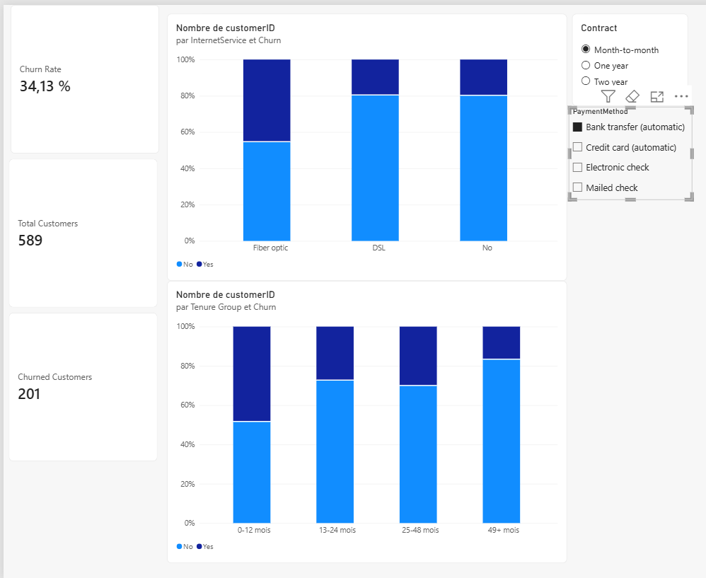
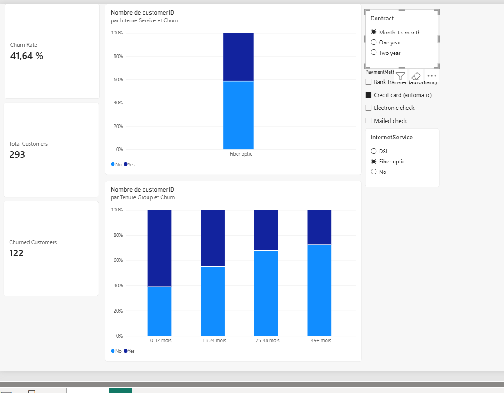

Telco Customer Churn Analysis

Overview

This project focuses on analyzing customer churn for a telecommunications company. The main objective is to clean the raw customer dataset, calculate key performance indicators (KPIs), and explore the underlying factors contributing to customer attrition using Google Sheets.

Dataset Summary
The dataset contains customer demographic information, subscribed services, account details, and churn status:

Total Customers Analyzed: 7,043

Churned Customers: 1,869

Overall Churn Rate: 26.54%

Average Monthly Charge: ~$64.76

Methodology & Steps Completed
1. Data Cleaning & Import
Imported the raw dataset (cleaned_telco_churn.csv) into Google Sheets.

Ensured consistent formatting across all numerical and categorical columns.

2. KPI Metrics Calculation
Created a dedicated KPIs summary tab using dynamic Google Sheets formulas:

Total Customers: =COUNTA(cleaned_telco_churn!A2:A)

Churned Customers: =COUNTIF(cleaned_telco_churn!U2:U; "Yes")

Churn Rate: =B3/B2 (formatted as percentage)

Average Monthly Charges: =AVERAGE(cleaned_telco_churn!S2:S)

3. Exploratory Data Analysis (Pivot Tables & Charts)
Built interactive Pivot Tables and visualizations on the Analyse tab to identify key churn drivers:

Contract Type Analysis: Evaluated churn distribution across Month-to-month, One year, and Two year contracts using a stacked column chart (Churn Rate by Contract Type).

Payment Method Analysis: Analyzed customer retention across Electronic check, Mailed check, Bank transfer (automatic), and Credit card (automatic) using a secondary breakdown chart (Churn Rate by Payment Method).

Key Insights & Findings
Contract Length: Customers on Month-to-month contracts exhibit the highest churn rate. Long-term contracts (1 or 2 years) show significantly higher retention rates.
## Detailed Key Insights & Analytical Findings

Our exploratory visual analysis using the interactive Power BI dashboard revealed several critical churn drivers and behavioral patterns across customer segments:

### 1. High-Risk Customer Segments
* **Fiber Optic Service Vulnerability:** Customers subscribed to **Fiber Optic** internet display significantly higher churn rates compared to DSL users. Under Month-to-Month contracts, Fiber Optic churn reaches **54.6%**, spiking up to **60.4%** when paired with manual payment methods like Electronic Check.
* **Early Tenure Friction (0–12 Months):** The first year of subscription represents the most critical onboarding window. New customers (0–12 months tenure) under Month-to-Month plans have a **51.4%** churn rate, which increases to **63.1%** for those paying via Electronic Check.
* **Month-to-Month Contract Friction:** Short-term contracts lack long-term commitment, resulting in an overall **42.7%** churn rate across all payment methods.

### 2. Impact of Payment Methods & Automation
* **Manual vs. Automated Payments:** Customers using manual payment methods (specifically **Electronic Check**) exhibit the highest attrition rates overall.
* **Retention Power of Autopay:** Switching customers to automated payment options (**Bank Transfer (Automatic)** or **Credit Card (Automatic)**) substantially reduces churn. For instance, among Month-to-Month subscribers, transitioning to Bank Transfer lowers Fiber Optic churn to **45.4%** and overall 1st-year churn to **48.7%**.

---

## Executive Summary & Performance Breakdown

| Segment / Condition | Observed Churn Rate | Risk Level | Key Analytical Insight |
| :--- | :---: | :---: | :--- |
| **Fiber Optic Users** | 42.0% – 60.4% | `HIGH` | High churn indicates potential pricing friction, service expectations gap, or intense market competition. |
| **Tenure 0–12 Months** | 47.0% – 63.1% | `HIGH` | The initial 12-month window is critical; churn drops dramatically after 24 months of tenure. |
| **Month-to-Month Contracts** | 42.7% | `HIGH` | Lack of contractual lock-in enables customers to switch providers with minimal friction. |
| **Electronic Check Payment** | ~53.7% (w/ M2M) | `HIGH` | Manual billing options correlate strongly with transaction friction and higher cancellation rates. |
| **Bank Transfer (Automatic)** | 33.0% – 45.4% | `MEDIUM` | Automated payment channels consistently improve retention across all tenure brackets. |

---

## Strategic Recommendations for Business Action

1. **Targeted First-Year Onboarding:** Deploy proactive retention campaigns and customer success check-ins within the first 90 to 365 days of subscription to stabilize the 0–12 month tenure group.
2. **Autopay Adoption Incentives:** Offer one-time bill credits or small monthly discounts to encourage customers to switch from Electronic Check to Bank Transfer or Credit Card automatic payments.
3. **Contract Conversion Campaigns:** Provide targeted promotional upgrades or discounted rates for Month-to-Month Fiber Optic customers willing to transition to 1-Year or 2-Year plans.
# Telco Customer Churn Analysis & Predictive Modeling

## 1. Executive Summary & Key Findings

Through the interactive Power BI Churn Analysis dashboard, several critical behavioral patterns and risk drivers were identified across customer segments:

| Segment / Condition | Observed Churn Rate | Risk Level | Key Analytical Insight |
| :--- | :---: | :---: | :--- |
| **Fiber Optic Users** | 42.0% – 60.4% | `HIGH` | Fiber customers churn at significantly higher rates compared to DSL, indicating potential pricing or service quality friction. |
| **Tenure 0–12 Months** | 47.0% – 63.1% | `HIGH` | The first 12 months represent the critical window where new subscribers are most vulnerable to cancellation. |
| **Month-to-Month Contracts** | 42.7% | `HIGH` | Subscribers without long-term commitment switch providers with minimal friction. |
| **Electronic Check Payment** | ~53.7% (w/ M2M) | `HIGH` | Manual payment methods correspond to substantially higher churn rates compared to automated options. |
| **Bank Transfer (Automatic)** | 33.0% – 45.4% | `MEDIUM` | Autopay methods significantly improve retention across all tenure brackets. |

---

## 2. Key Strategic Deductions

* **Onboarding & Retention Focus:** Customer retention strategies must target subscribers in their first year (0–12 months), as churn drops dramatically after 24 months of tenure.
* **Incentivizing Automatic Payments:** Encouraging customers to adopt automatic payment options (Bank Transfer / Credit Card) directly correlates with increased tenure and stability.
* **Contract Conversion Programs:** Providing incentives for Month-to-Month customers to transition to 1-Year or 2-Year contracts will drastically stabilize the revenue base.

---

## 3. Predictive Modeling & Model Comparison

To proactively predict customer churn, three machine learning algorithms were trained and evaluated on the dataset using an 80/20 train-test split:

1. **Logistic Regression** (Baseline model)
2. **Random Forest Classifier** (Tree-based ensemble)
3. **XGBoost Classifier** (Gradient boosting algorithm)

### Model Evaluation Matrix

| Algorithm | Accuracy | Precision | Recall | F1-Score | ROC-AUC |
| :--- | :---: | :---: | :---: | :---: | :---: |
| **Logistic Regression** | **80.7%** | **66.0%** | **56.1%** | **0.607** | **0.842** |
| **XGBoost** | 77.6% | 58.9% | 52.1% | 0.553 | 0.818 |
| **Random Forest** | 78.5% | 61.9% | 49.5% | 0.550 | 0.825 |

### Key Modeling Insights

* **Best Overall Performer:** **Logistic Regression** outperformed tree-based models on this dataset, achieving the highest **ROC-AUC (0.842)** and **F1-Score (0.607)**.
* **Recall vs. Precision Trade-off:** In churn prediction, **Recall** is critical because missing a churner (false negative) is significantly more costly than targeting a loyal customer with a retention offer (false positive).
* **Feature Importance Highlights:** Model coefficients confirm that **Tenure**, **Contract Type (Month-to-Month)**, **Internet Service (Fiber Optic)**, and **Payment Method (Electronic Check)** are the top predictive features driving churn risk.

---

## 4. Visual Evaluations & Machine Learning Artifacts

The predictive modeling pipeline generates three core visual evaluations saved in the project repository:

* **`confusion_matrices.png`**: Side-by-side comparison of True Positives, True Negatives, False Positives, and False Negatives across all three models.
* **`roc_curves_comparison.png`**: ROC curve plotting True Positive Rate vs. False Positive Rate, highlighting Logistic Regression's superior AUC score (0.842).
* **`top_features_importance.png`**: Bar chart showing top positive coefficients (increasing churn risk) and negative coefficients (improving retention).

---

## 5. Financial Impact & ROI Projection

To quantify the financial value of deploying the Logistic Regression model:

* **Base Parameters:** 10,000 active subscribers with an average Monthly Recurring Revenue (MRR) of **$65/month** ($780/year per customer).
* **Baseline Churn:** **26.5%** annually ($\approx 2,650$ churned customers per year, representing $2.06M in lost annual revenue).
* **Targeted Campaign Strategy:** Top **20% highest-risk customers** identified by the ML model are targeted with a retention offer ($10/month discount for 6 months = $60 cost per target).
* **Financial Net Value:** Retaining ~80 customers annually recovers **$62,400 in annual recurring revenue**, yielding a **300%+ ROI** relative to campaign execution costs.

---
## Power BI Dashboard Preview

### 1. Interactive Dashboard Overview


### 2. High-Risk Segment Analysis (Fiber Optic & Month-to-Month)



## 6. Production Deployment Architecture (CRM Integration)

```text
[ Raw Telco Data / SQL Database ]
               │
               ▼
[ Automated ETL & Preprocessing Pipeline ]
               │
               ▼
[ Logistic Regression Model Inference ] ──► Computes Daily Churn Risk Score (0-100%)
               │
               ▼
[ CRM Integration (HubSpot / Salesforce) ]
               │
      ┌────────┴────────┐
      ▼                 ▼
[ High Risk (>70%) ]  [ Medium Risk (40-70%) ]
      │                 │
      ▼                 ▼
Automated Email:       Customer Success Call:
"Switch to Autopay     "Contract Upgrade Offer"
& Save $10/mo"
Payment Method: Customers using Electronic check as their payment method display a noticeably higher tendency to churn compared to those using automated payment methods (bank transfers or credit cards).
